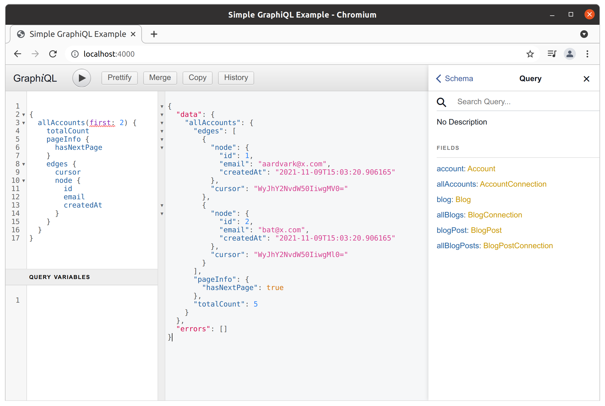

# `pg_graphql`

<p>
<a href=""></a>
<a href="https://github.com/supabase/pg_graphql/blob/master/LICENSE"></a>
<a href="https://github.com/supabase/pg_graphql/actions"></a>

</p>

---

**Documentation**: <a href="https://supabase.github.io/pg_graphql" target="_blank">https://supabase.github.io/pg_graphql</a>

**Source Code**: <a href="https://github.com/supabase/pg_graphql" target="_blank">https://github.com/supabase/pg_graphql</a>

---

Query your existing PostgreSQL database with GraphQL

`pg_graphql` inspects your PostgreSQL schema and reflects a GraphQL schema with resolvers.

- [x] __Performant__: [+2k requests/second](performance.md)
- [x] __Always up-to-date__: Reflected from the SQL schema
- [x] __Pagination__: Relay compliant
- [x] __Serverless__: Runs in your database with no *additional* server required
- [x] __Open Source__: Apache License 2.0

!!! warning
    pg_graphql is pre-alpha software under active development


### Motivation
`pg_graphql` provides an SQL schema -> GraphQL schema reflection engine and an associated GraphQL query -> SQL query transpiler.

The extension keeps schema generation, query parsing, and resolvers all neatly contained on your database. This enables any programming language that can connect to PostgreSQL to query the database via GraphQL with no additional servers, processes, or libraries.


### TL;DR

The SQL schema

```sql
--8<-- "docs/assets/demo_schema.sql"
```
Translates into a GraphQL schema exposing each table as a pageable collection with relationships defined by the foreign keys.

