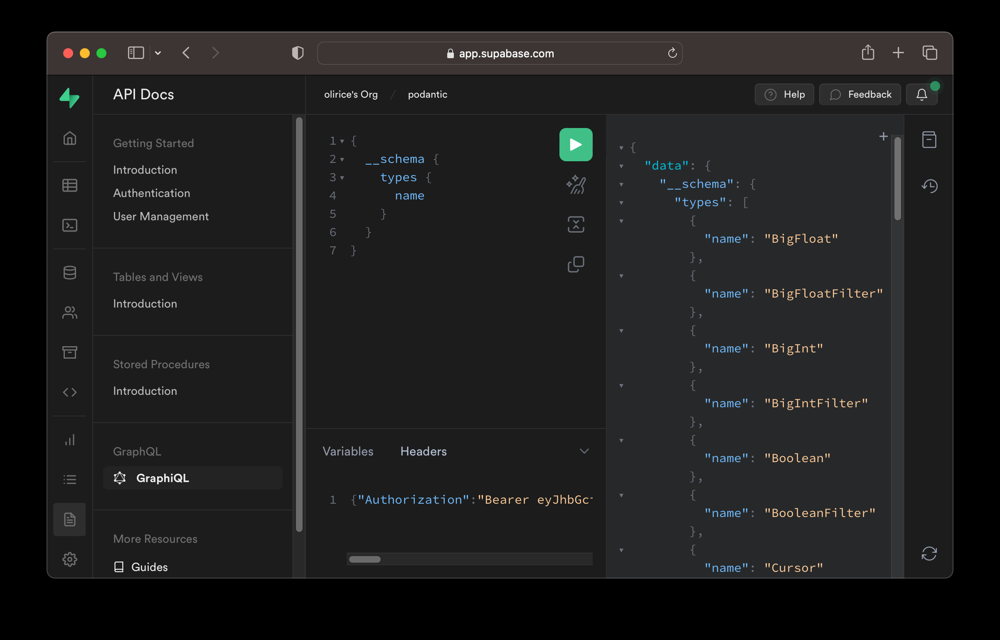
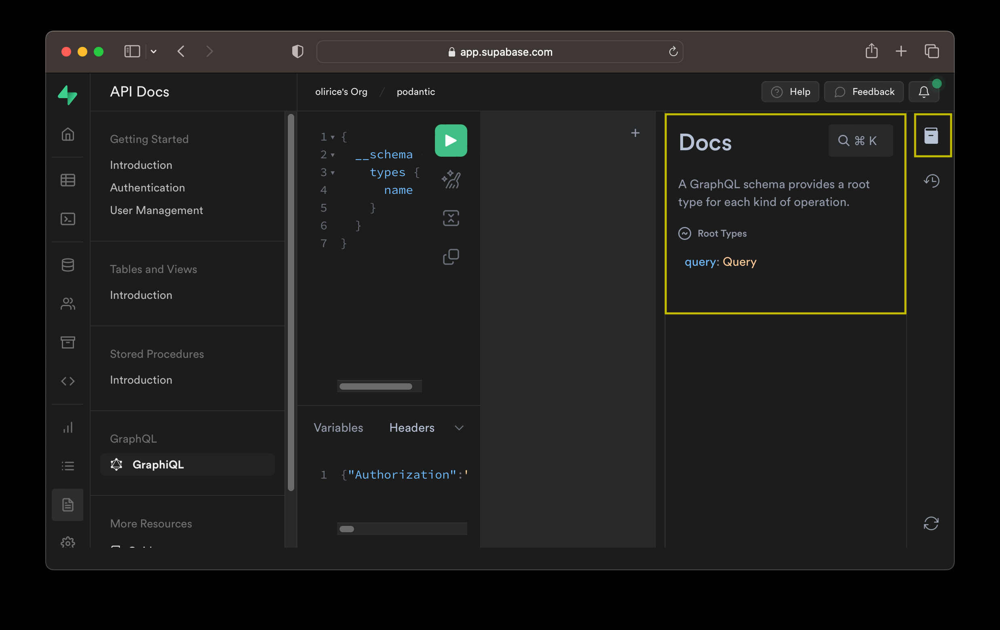
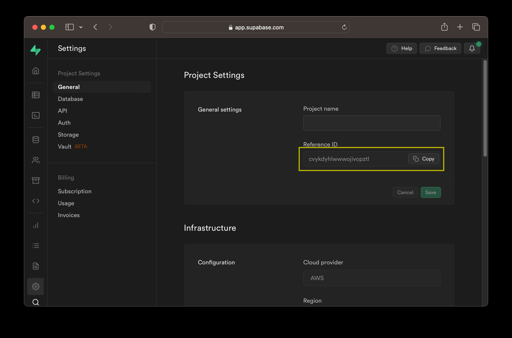
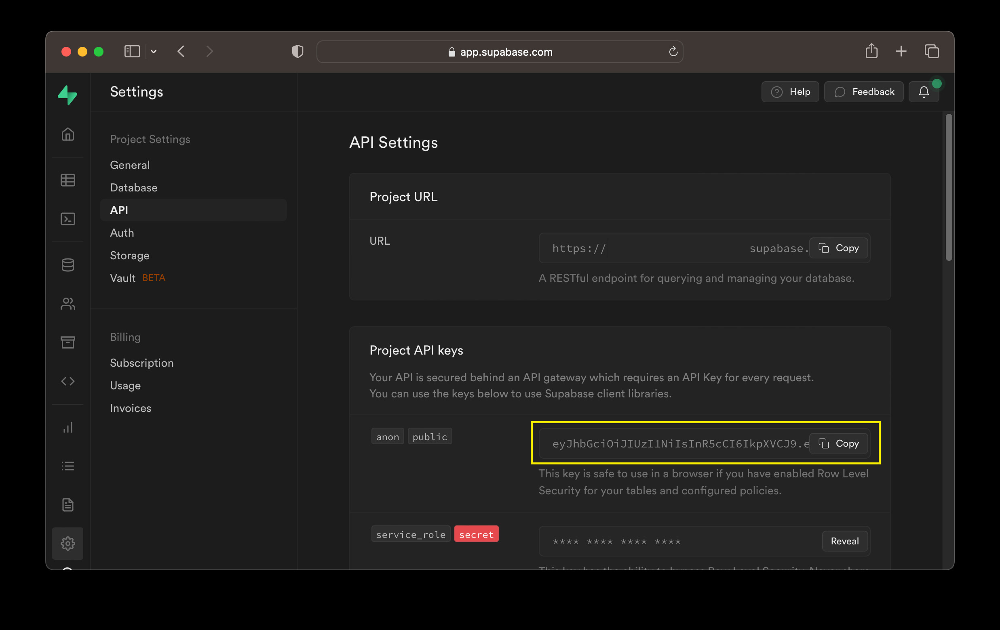

Supabase uses [pg_graphql](https://github.com/supabase/pg_graphql) to expose a GraphQL API for every project.

The GraphQL API is automatically reflected from your database's schema and supports:

- Basic CRUD operations (Create/Read/Update/Delete)
- Support for Tables, Views, Materialized Views, and Foreign Tables
- Arbitrarily deep relationships among tables/views
- User defined computed fields
- The Postgres security model - including Row Level Security, Roles, and Grants.


All requests resolve in a single round-trip leading to fast response times and high throughput.

You can introspect and query the GraphQL API of an existing Supabase project within Supabase Studio [here](https://app.supabase.com/project/_/api/graphiql) and selecting the relevant project.


# API

## Requirements

The minimum requirements to make a request to the GraphQL API are:

- A local or hosted supabase project
- The project's GraphQL API's URL
- The project's API Key

Once you've [created a Supabase Project](database.new) you're ready to make requests

### Make a Request

First, collect your [project reference](#project-reference-project_ref) and [API Key](#api-key-api_key).

### Supabase Studio

The easiest way to make an GraphQL request with Supabase is to use Supabase Studio's builtin GraphiQL IDE to inspect and interact with your GraphQL API.
You can access GraphiQL for your project [here](https://app.supabase.com/project/_/api/graphiql) by selecting the relevant project. Alternatively, navigate there manually at `API Docs > GraphQL > GraphiQL`.

.

Once there, type queries in the central query editor and use the green icon to submit requests to the sever. Results are shown in the output display to the right of the editor.

To explore the API visually, select the docs icon shown below and navigate through each type to see how they connect to the Graph.

.

Since pg_graphql reflects the GraphQL API from the structure of the project's SQL tables and views, if your project is empty, the GraphQL API will similarly be empty except for intropection types. For a more interesting result, go to the SQL or table editor, create a table, and head back to GraphiQL to view see that table reflected in your i

### cURL

To hit the Supabase GraphQL API using cURL, post to the URL shown below, substituting in your PROJECT_REF and passing the project's [API Key](#api-key-api_key) as the `apiKey` header:


```sh
curl -X POST https://<PROJECT_REF>.supabase.co/graphql/v1 \
    -H 'apiKey: <API_KEY>' \
    -H 'Content-Type: application/json' \
    --data-raw '{"query": "{ accountCollection(first: 1) { edges { node { id } } } }", "variables": {}}'
```

### supabase-js


```

```


## Connecting GraphiQL

```html
<html>
  <head>
    <title>GraphiQL</title>
    <link href="https://cdnjs.cloudflare.com/ajax/libs/graphiql/2.4.7/graphiql.css" rel="stylesheet" />
  </head>
  <body style="margin: 0;">
    <div id="graphiql" style="height: 100vh;"></div>
    <script crossorigin src="https://unpkg.com/react@18/umd/react.production.min.js"></script>
    <script crossorigin src="https://unpkg.com/react-dom@18/umd/react-dom.production.min.js"></script>
    <script
      crossorigin
      src="https://cdnjs.cloudflare.com/ajax/libs/graphiql/2.4.7/graphiql.js"
    ></script>
    <script>

      ////////////////
      // EDIT BELOW //
      ////////////////

      const fetcher = GraphiQL.createFetcher({
        url: 'https://<PROJECT_REF>.supabase.co/graphql/v1',
        headers: {
          "apiKey": "<YOUR_API_KEY>",
        }
      });
      ReactDOM.render(
        React.createElement(GraphiQL, { fetcher: fetcher }),
        document.getElementById('graphiql'),
      );
    </script>
  </body>
</html>
```

## Version Upgrades

See which version is installed, and which is available

```sql
select * from pg_available_extensions;
```

```sql
drop extension pg_graphql;
create extension pg_graphql;
```

## FAQ

1. Beta test unreleased feature

2. Support for subscriptions

3. ...


## Terminology Reference

### Project Reference (PROJECT_REF)

Your Supabase project reference or PROJECT_REF is a 20 digit unique identifer for your project, for example `bvykdyhlwawojivopztl`.
The project reference is used throughout your supabase application including the project's API URL. You can find the project reference in by logging
in to Supabase Studio




### API Key (API_KEY)

Your Supabase API Key is a public value that must be sent with every API request. The key is visible in Supabase Studio at `Settings > API > Project API keys`




or from the output of `supabase start` when running a local project with the [Supabase CLI](https://supabase.com/docs/guides/cli)

```sh
> supabase start
...

Started supabase local development setup.

         API URL: ...
     GraphQL URL: ...
          DB URL: ...
      Studio URL: ...
    Inbucket URL: ...
      JWT secret: ...
        anon key: eyJhbGciOiJIUzI1...<truncated>   <-- API_KEY
service_role key: ...
```
